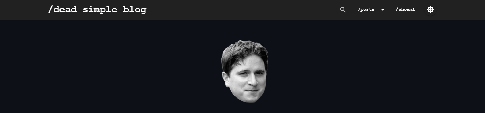

# dead-simple-blog

[](#)
[](#)
[](#)
[](https://twitter.com/Ooggule)

dead-simple blog template powered by Markdown and PHP

## Installation

```sh
apt install git
git clone
cd dead-simple-blog

usermod -a -G docker {user}
# disconnect/reconnect after this command
```

Change domain name "website.com" in `docker-compose.yaml`, `apache_conf` and `blog/website.conf.php`.

change mysql passwords and usernames in `docker-compose.yaml` and `blog/website.conf.php`.

```sh
cd dead-simple-blog
docker network create web
docker-compose up -d
# Here we go!
```

<br>

## Usage

Everything lies in `website.conf.php` as well as `sitemap.json` files in blog/.

#### website.conf.php

In this file, you can setup everything related to the website customization (title, description, header, profile picture, colors...). The variables names are self explanables.

#### sitemap.json

This is where you add your articles. There are example of how to do it in the sample file. Basically, you can add articles which point to etheir `.md` or `.html/.php` file, and the engine will take care of displaying it on the website. Note that you can add `"hidden": true` to an article to hide it from the list (the article can still be accessed via it's URL). The examples shows the different possibilities you have to create perfect articles!

Please be aware that the articles are not sorted by date, but by apparition, meaning the article at the top of the file will be the first to show up.

<br>

## Update guide

#### You can use the update.sh script to update your apache2/src/ directory by doing the following (thanks to [@Kevin-Mizu](https://github.com/Kevin-Mizu)):   
(don't forget to change the path in your command)   
```
wget https://raw.githubusercontent.com/Ooggle/dead-simple-blog/master/update.sh && chmod u+x ./update.sh
./update.sh path/to/your/apache2/src/
```

### Manual update (not recommanded)

In order to update the website to the latest version, you need to download the latest release, copy the content of the new `src/apache2/src/` in your own `apache2/src/` directory.

:warning: If you don't want all your work to be lost, don't copy:   
- assets/inc/whoami.php
- .htaccess   
- articles/   
- favicon.png   
- website.conf.php   
- sitemap.json   

New options may be needed in your `website.conf.php` file. Check the release changelog in order to update your configuration file consequently (if you are updating from the upstream git, check the commit messages).
